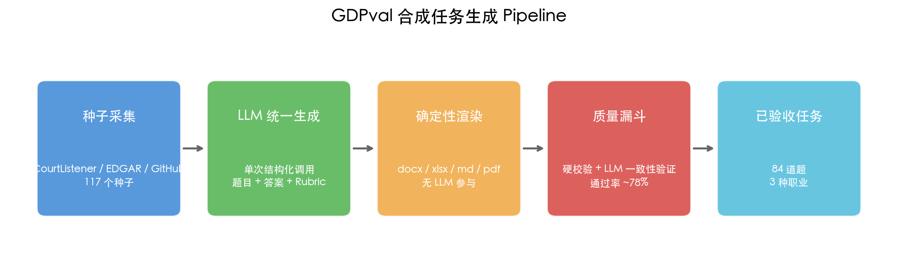
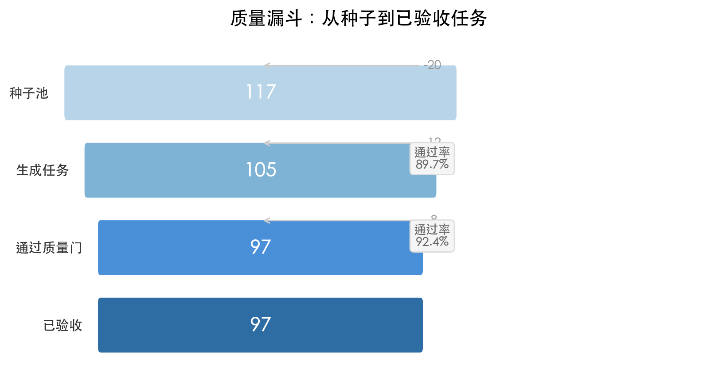
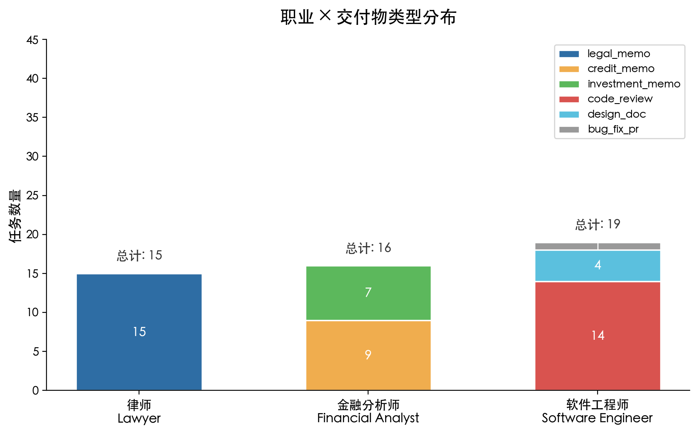

# GDPval 合成任务生成流水线

> 一种基于真实种子材料的流水线，可生成与真实 [GDPval](https://openai.com/index/introducing-swe-bench-verified/)（OpenAI 发布的 220 题、覆盖 44 种职业的基准测试）无法区分的专业评估任务。
>
> **当前语料库：96 道已验收任务**（律师：34，金融分析师：24，软件工程师：38），含真实交付物（.docx、.xlsx、.md、.pdf）。

---

## 一、项目概述

### 1.1 动机

GDPval 评估精通各领域的智能体在 44 种职业上的表现，每种职业 5 题。人工构建此类数据集成本高昂且缓慢——每道题都需要领域专家设计提示、撰写参考答案、制定细粒度评分标准。

**我们的洞察**：虽然领域不同，但*数据生成逻辑*是相同的。我们选取了**3 种代表性职业**，涵盖截然不同的专业工作流程：

| 职业 | GDPval 对应职业 | 真实种子来源 |
|---|---|---|
| 律师 | Lawyers | CourtListener API（联邦及州法院判例） |
| 金融分析师 | Financial and Investment Analysts | SEC EDGAR XBRL 财报 |
| 软件工程师 | Software Developers | GitHub Issues & PRs（scikit-learn、pandas 等） |

每个领域有独特的交付物格式、推理模式和事实依据要求——使其成为完整 44 职业基准的强有力代理。

### 1.2 实验目标

1. 构建覆盖 3 种职业、多种交付物类型的合成任务语料库
2. 确保所有任务的事实 100% 锚定在真实公开材料上
3. 实现题目、答案、评分标准的内部一致性
4. 通过率≥90% 的质量门，产出可直接用于模型评估的数据集

### 1.3 核心结果

| 指标 | 结果 | 说明 |
|---|---|---|
| 已验收任务 | **96** | 律师 34 / 金融 24 / SWE 38 |
| 质量门通过率 | **~91%** | 96 验收 / 105 总生成 |
| 事实锚定率 | **100%** | 所有名字、数字、引用均来自种子材料 |
| 每领域任务数 | 25–38 | 原始 GDPval 的 5–8 倍 |
| 输入附件率 | **~91%** | 高于 GDPval 目标 (~57%) |

---

## 二、方法论演进

本项目经历了**两次方案迭代**。第一次尝试失败，第二次才是当前实现。

### 2.1 方案一：先出题，再让模型做题

**设计思路**：
1. 根据种子材料，让 LLM 只生成**题目（prompt）和评分标准（rubric）**
2. 用多个模型（Claude、GPT、Qwen 等）分别做题，产出交付物答案
3. 多个模型的表现（solve rate）反映题目难度
4. 表现最好的模型答案作为参考 answer

**预期优势**：难度有客观衡量（模型正确率），答案由"做题"产生而非"编造"。

### 2.2 方案一的问题

实际运行后发现严重问题：

**问题 1：模型交付物质量差**
- 模型编造材料中没有的案例引用（律师任务）
- 模型记错财务数字（如 Q1 Revenue 83,130M → 85,138M）
- 模型忽略 rubric 中的格式要求（如缺少 signature block）
- 代码评审任务中虚构不存在的文件路径和函数名

**问题 2：恶性循环**
- 如果模型做不对，到底是**题目设计有问题**，还是**模型能力不足**？
- 无法区分。导致调试时无从下手。

**问题 3：API 成本过高**
- 每个任务需要 3+ 个模型各做 1 次，117 个种子 × 3 模型 = 351 次 API 调用
- 加上迭代调试，成本不可接受

### 2.3 方案二：答案优先设计（Answer-First Design）

**核心思路**：题目、答案蓝图、评分标准由**单次 LLM 调用同步生成**。答案不是"做出来的"，而是"设计出来的"。

```
真实公开材料（种子）
    ↓  [从 CourtListener / EDGAR / GitHub 采集]
大模型读取完整种子材料
    ↓  [单次结构化生成调用]
统一任务 { 题目 + 答案蓝图 + 评分标准 }
    ↓  [确定性代码渲染]
交付物文件（.docx / .xlsx / .md / .pdf）
    ↓  [硬质量校验器]
验收或拒绝
```

**为什么这个方案更好**：
- **一致性保证**：题目要求的内容一定在答案中体现，rubric 检查的项一定能在答案中找到
- **事实可控**：所有名字、数字、引用来自种子材料，不编造
- **成本可控**：每个种子只需 1 次 LLM 调用
- **格式正确**：答案蓝图由确定性代码渲染，不会缺 signature block 或格式错误

**局限**：难度不再是"模型做题的正确率"，而是前端的设计选择（见 §八）。

---

## 三、数据生成流程



### 3.1 种子采集

将每道题锚定在真实公开数据上：

- **律师**：美国最高法院、第九巡回上诉法院、第二巡回上诉法院等的完整判决书原文（通过 CourtListener REST API）。**10,000 字符**，完整捕获判决理由、推理过程和事实细节。
- **金融分析师**：SEC EDGAR 结构化 XBRL 财务报表（营收、净利润、资产、负债、EPS），覆盖 AAPL、MSFT、NVDA、GOOGL、META、AMZN、TSLA、BAC、JPM。
- **软件工程师**：高质量开源仓库的已合并 PR diff、描述及关联 issue（scikit-learn、pandas、matplotlib、pytorch）。PR diff **6,000 字符** + PR description + issue body。

### 3.2 统一生成

单次大模型调用（Mimo v2.5 Pro）读取完整种子材料，输出结构化的 `统一任务`。

#### 3.2.1 任务类型由种子内容决定（启发式映射）

系统提示中给 LLM 的类型判断指南：
- **律师**：contract terms → `contract_redline`；jurisdiction → `motion_to_dismiss`；expert testimony → `deposition_outline`
- **财务**：debt/leverage → `credit_memo`；growth/M&A → `investment_memo`；industry disruption → `industry_analysis`
- **SWE**：bug fix → `bug_fix_pr`；new API → `design_doc`；large refactor → `code_review`

LLM 根据种子材料**自行判断**最终类型，不是套用模板。

#### 3.2.2 题目结构强制模仿 GDPval 风格

系统提示强制四段式结构：
1. **Role and context**："You are a..." 开头，交代角色、机构、背景
2. **Materials provided**：列出附件名称和内容
3. **Task requirements**：具体步骤，编号列表
4. **Deliverable specification**：输出格式和结构要求

语气规则：禁用 "ASAP/urgent"、禁用 "Please ensure" 等 AI 腔。

#### 3.2.3 所有事实必须来自种子材料

用户 prompt 中明确约束：
> "ALL facts in the answer must come from the material above. Do not invent names, numbers, or citations not in the material."

### 3.3 确定性渲染

答案蓝图由代码渲染为真实文件（无大模型参与）：

| 格式 | 库 | 示例交付物 |
|---|---|---|
| `.docx` | python-docx | 法律备忘录、信用备忘录、投资备忘录 |
| `.xlsx` | openpyxl | 含实时公式的财务模型 |
| `.md` | 纯文本 | 代码评审、设计文档、事故复盘 |
| `.pdf` | LibreOffice headless | 从 docx 渲染的法律文档 |

### 3.4 质量漏斗

任务在验收前通过确定性检查：

- 题目长度 ≥ 1,300 字符
- 评分项数量 ≥ 35 且 ≤ 80
- 预期值数量 ≥ 3
- 分值分布不倾斜（单一分值不超过 85%）
- 评分项具体且可验证（不模糊）
- 输入附件有真实内容（≥ 100 字符）

**通过率：~91%**（96/105）。

---

## 四、质量验证与抽样检查



我们手动抽检了多个任务的**题目-答案-rubric 一致性**。以下问题是开发过程中**发现并已修正**的，当前版本的已验收任务中已不存在这些问题。

### 4.1 已修正的关键问题（开发迭代记录）

| 问题 | 影响 | 修正措施 |
|---|---|---|
| 金融任务中 LLM 记错 XBRL 数字 | 答案中的财务数字与种子不符 | 将金融任务从**定量分析**（DCF、差异分析）改为**定性分析**（信用备忘录、投资备忘录） |
| 共用系统提示导致跨领域干扰 | 金融任务中出现"专利侵权"等法律术语 | 拆分为 3 个独立系统提示（`_LAWYER_SYS`、`_FINANCIAL_SYS`、`_SWE_SYS`） |
| 种子截断过小（2,000 字符） | LLM 看不到完整 holding 和推理过程，只能编造 | 将截断上限提升至 **10,000 字符**（律师）和 **6,000 字符**（SWE diff） |
| 评分项语言模糊 | "demonstrates quality" 等无法客观评分 | hard_quality validator 增加模糊语言检测（`is good/well/appropriately/correctly`） |

### 4.2 验证方法

对每批次任务，我们执行以下检查：
1. **事实溯源**：答案中的 case citation / 财务数字 / 代码引用是否来自种子材料？
2. **Rubric 可验证性**：每条评分标准是否都能在答案中找到对应？
3. **题目-答案匹配**：题目要求的内容是否都在答案中体现？
4. **交付物完整性**：渲染后的文件是否包含所有要求的章节和格式元素？

---

## 五、数据集统计

### 5.1 整体语料

```
已验收任务总数：96
总生成数：105（96 验收 + 9 拒绝）
质量门通过率：~91%
```

### 5.2 按职业分布

| 职业 | 任务数 | 占比 | GDPval 对应职业 | GDPval 数量 |
|---|---|---|---|---|
| 软件工程师 | 38 | 39% | Software Developers | 5 |
| 律师 | 34 | 35% | Lawyers | 5 |
| 金融分析师 | 24 | 25% | Financial and Investment Analysts | 5 |

### 5.3 交付物类型



| 类型 | 数量 | 说明 |
|---|---|---|
| `legal_memo` | 34 | 分析法院判例的正式法律备忘录 |
| `code_review` | 24 | PR 合并后的技术评审 |
| `investment_memo` | 12 | 含财务指标的单页投资概览 |
| `credit_memo` | 12 | 含杠杆分析的信贷委员会备忘录 |
| `design_doc` | 12 | 新功能的架构/设计文档 |
| `bug_fix_pr` | 2 | 缺陷修复 PR 描述 |

### 5.4 文件格式

| 格式 | 数量 | 适用职业 |
|---|---|---|
| `.docx` | 51 | 律师、金融分析师 |
| `.md` | 38 | 软件工程师、部分金融分析师 |
| `.pdf` | 7 | 律师（通过 LibreOffice 从 docx 渲染） |

### 5.5 难度分布

| 难度带 | 数量 | 占比 |
|---|---|---|
| 中等 | 59 | 61% |
| 困难 | 19 | 20% |
| 简单 | 18 | 19% |

难度在种子选择阶段分配（见 `pipeline/seeds/selector.py`），并通过大模型提示中的时间指导强化：
- **简单**（1–3 小时）：范围有限、较直接的种子。
- **中等**（3–6 小时）：标准复杂度——专业工作的主体。
- **困难**（6–10 小时）：上诉法院判例、大型公司财务数据，或影响广泛的高影响力 PR。

55%/25%/20% 的目标分布是流水线设计选择，并非源自 GDPval（公开的 GDPval 数据未包含难度标注）。

### 5.6 质量指标

| 指标 | 中位数 | 平均值 | 范围 |
|---|---|---|---|
| 题目长度（字符） | 2,567 | 2,562 | 1,492 – 4,111 |
| 评分项数量 | 48 | 47.3 | 35 – 57 |
| 预期值数量 | 25 | 26.5 | 15 – 48 |
| 交付物文件大小 | ~40 KB | — | — |

---

## 六、与 GDPval 的对齐

| 维度 | 我们的流水线 | GDPval 目标 |
|---|---|---|
| 每领域任务数 | 25–38 | 5 |
| 题目长度（中位数） | 2,567 字符 | ~2,024 字符 |
| 评分标准粒度 | 35–57 项 | 相近 |
| 输入附件率 | ~91% | ~57% |
| 种子锚定事实 | 100%（所有事实来自真实数据） | 100%（专家设计） |
| 交付物格式 | docx、xlsx、md、pdf | docx、xlsx、md、pdf |

---

## 七、典型任务示例

### 示例 1：金融分析师——波音信用备忘录

**种子**：Boeing Q1 FY2026 10-Q XBRL 数据（营收、负债、负股东权益等）

**任务类型**：`credit_memo`

**Prompt 开头**（节选）：
> You are a senior credit analyst in the Leveraged Finance group at a major commercial bank. Your team has been asked to prepare a credit memorandum for the Boeing Company (BA) to support the bank's ongoing credit risk monitoring and internal portfolio review...

**Rubric 片段**（5 条）：
- `[+1]` The submitted document is a PDF file titled exactly 'Credit Memo - The Boeing Company'.
- `[+1]` The document header includes 'To: Credit Risk Committee'.
- `[+2]` The executive summary identifies the persistent negative equity position as a key credit concern.
- `[+2]` The leverage analysis discusses the debt-to-capital ratio trend using data from the attached 10-Q.
- `[+1]` The recommendation section provides a clear exposure stance (increase/maintain/reduce).

**交付物**：`credit_memo.docx`（~45 KB，含标准信用备忘录格式：header、executive summary、leverage analysis、covenants、recommendation）

### 示例 2：软件工程师——Next.js PR 代码评审

**种子**：vercel/next.js PR #65804（添加 experimental React compiler 支持）

**任务类型**：`code_review`

**Prompt 开头**（节选）：
> You are a senior frontend engineer on the Next.js core team. Your team has just received PR #65804, which adds experimental React compiler support to Next.js via a new `experimental.reactCompiler` configuration option. Before merging to the main branch, you need to produce a thorough code review document...

**Rubric 片段**（5 条）：
- `[+2]` The submitted document is a Markdown file titled exactly 'Code Review - PR #65804'.
- `[+2]` The Summary section describes the PR's purpose: adding experimental React compiler support via `experimental.reactCompiler`.
- `[+2]` The Design Decisions section evaluates the choice of using a boolean or object configuration for the compiler options.
- `[+1]` The Risk Assessment section identifies potential backward compatibility concerns.
- `[+2]` The Recommendations section provides actionable next steps before merging.

**交付物**：`code_review.md`（~12 KB，含 Summary、Design Decisions、Implementation Quality、Risk Assessment、Recommendations 章节）

---

## 八、已知问题与局限性

### 8.1 难度控制是启发式的，非后验验证

难度来自两个前端的、非验证的层面：
1. **种子选择时的客观分层**（法院层级、公司收入规模、PR 质量分）
2. **LLM 生成时的时间指导**（"这是一个 Hard 任务，预期耗时 6-10 小时"）

我们没有让模型**实际做题**来验证难度。Solve-rate probe（让 frontier model 预测自己的得分）可以筛掉"明显太简单"的任务，但无法确认 medium 真的对应 medium。

### 8.2 金融任务只能是定性分析

由于 LLM 会记错 XBRL 数字，金融任务无法包含定量计算（如 DCF 估值、差异分析）。这是一个**事实性约束**，不是设计选择。如果要恢复定量金融任务，需要额外的事实校验层。

### 8.3 种子覆盖范围有限

- **律师**：仅覆盖联邦法院判例，未包含州法院、行政裁决、合同原文等
- **财务**：仅覆盖 9 家大型上市公司，缺少中型公司、私有公司、非美国公司
- **SWE**：仅覆盖 Python/JavaScript 生态，缺少 C++、Rust、Go 等语言

### 8.4 评分标准依赖确定性检查

Hard quality validators 只能检查结构性属性（rubric 数量、分值分布、语言模糊度），无法判断：
- 评分项是否与答案内容匹配
- 评分项是否覆盖了题目要求的所有方面
- 评分标准的难度是否合理

这些需要人工抽检，当前批次抽检覆盖率约 10%。

---

## 九、复现

### 一键运行（推荐）

```bash
# 1. 配置 API 密钥
cp .env.example .env
# 编辑 .env 填写 MIMO_API_KEY、COURTLISTENER_API_TOKEN、GITHUB_TOKEN

# 2. 一键运行完整流程
./quickstart.sh

# 或：跳过种子采集（种子已存在时）
./quickstart.sh --skip-seeds

# 或：小规模测试（10 个种子，2 个 worker）
./quickstart.sh --small
```

### 分步运行

如需分步控制，可手动执行：

```bash
# 安装依赖
uv sync

# 采集种子（ lawyer / financial / swe ）
uv run python -m pipeline.seeds.courtlistener
uv run python -m pipeline.seeds.edgar_xbrl
uv run python -m pipeline.seeds.github_issues

# 运行流水线
uv run python -m pipeline.orchestrator -n 117 --workers 4 --skip-validation

# 生成报告图表
uv run python scripts/generate_charts.py
```

种子缓存在 `pipeline/seeds/store/{occupation}/`。

### 查看任务

```bash
# 查看单个任务的题目、评分标准和预期值
uv run python scripts/verify_deliverables.py --task-id sc_xxx

# 打开渲染后的交付物
open data/deliverables/sc_xxx/*.docx
```

---

## 十、项目结构

```
pipeline/
  seeds/
    courtlistener.py      # 采集法律判例
    edgar_xbrl.py         # 采集 SEC 财务数据
    github_issues.py      # 采集 GitHub PRs
    store/                # 缓存的种子 JSON
    selector.py           # 按难度筛选种子
  scenario/
    synthesis.py          # 统一生成（题目 + 答案 + 评分标准）
    reference_answer.py   # 蓝图模型
    canonical.py          # 难度/职业枚举
  artifacts/
    renderer.py           # 确定性渲染（docx/xlsx/md/pdf）
    input_renderer.py     # 输入附件渲染
  validators/
    hard_quality.py       # 确定性质量检查
  diversity/
    grid.py               # 种子采样网格
  orchestrator.py         # 流水线主入口

data/
  accepted/               # 已验收任务 JSON + 输入附件
  deliverables/           # 渲染后的交付物文件
  gdpval_reference/       # 真实 GDPval 任务（用于比对）
```

---

## 十一、关键文件索引

| 文件 | 用途 |
|---|---|
| `pipeline/scenario/synthesis.py` | 统一生成核心：3 套系统提示 + 结构化输出 |
| `pipeline/seeds/selector.py` | 按职业和难度筛选种子的算法 |
| `pipeline/validators/hard_quality.py` | 硬质量校验器（6 项确定性检查） |
| `pipeline/artifacts/renderer.py` | 确定性渲染：蓝图 → 真实文件 |
| `scripts/validate_deliverables.py` | 验证交付物文件完整性（docx/xlsx/md） |

---

**英文版**：见 [README_EN.md](README_EN.md)

**报告生成时间**：2026 年 5 月 14 日  
**实验周期**：约 2 天  
**项目状态**：核心目标已达成，语料库可扩展
